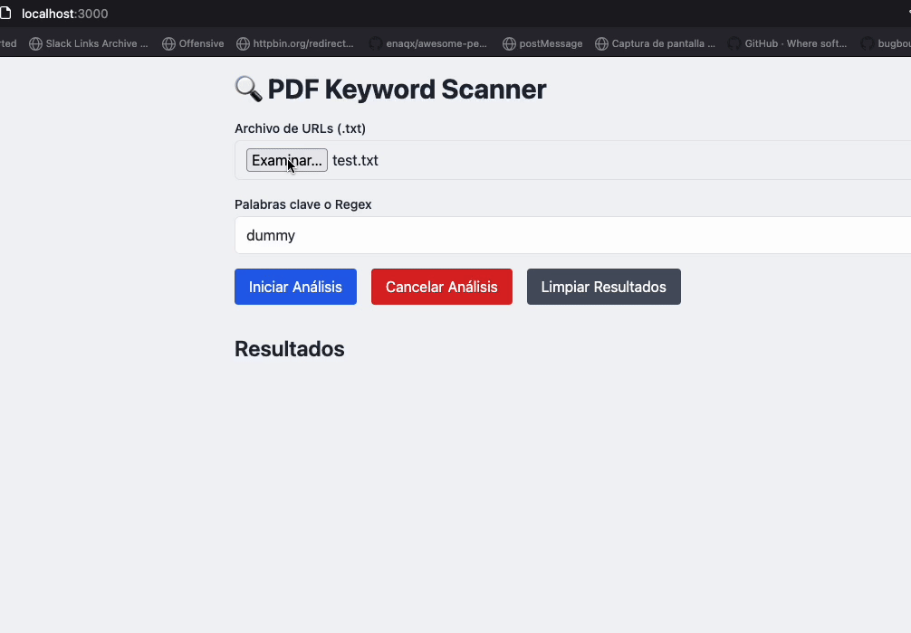

# PDF Keyword Scanner 🔍📄

This project scans PDF files from URLs for keywords or regex patterns.
It's useful for bug bounty hunting, digital forensics, or automated document audits.

Load your urls.txt
app retrieve pdfs
app scan for sensitive keywords or regex

## Features

* Load PDF URLs from a `.txt` file
* Search for keywords or regex patterns (including support for regex)
* Outputs match results clearly
* Lightweight and built with Node.js and Express

## Requirements

* Node.js (v18 or higher recommended)
* Git
* `waybackurls` or `gau` (for URL collection)
* Linux, macOS, or compatible terminal (WSL also works)

## Installation

```bash
git clone https://github.com/ak1t4/pdf-scanner.git
cd pdf-scanner
npm install
npm start
```

## Usage

### Generate URLs using waybackurls/gau

Use one of the following tools to gather historical URLs:

```bash
waybackurls example.com | grep '.pdf' > urls.txt
```

Or:

```bash
gau example.com | grep '.pdf' > urls.txt
```

* PDF files are stored under uploads/.pdf 

### Usage Example



## License
Free

**Made with Love by Ak1t4**
🔗 [Follow me on X](https://x.com/akita_zen)


